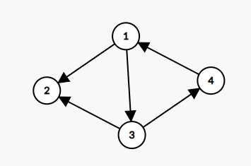
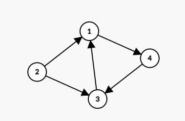

Kosaraju算法（aka Kosaraju-Sharir算法）是一个求强连通分量的算法。其时间复杂度为$O(n+m)$（邻接表）或$O(m^2)$（邻接矩阵）。

该算法相比Tarjan算法要更简单一些。（个人观点）

本算法的基础是**反图**（也被称作逆图、转置图）。

## 基本原理

### 反图

参见 [OI Wiki](https://oi-wiki.org/graph/concept/#%E5%8F%8D%E5%9B%BE) 的解释：


>  对于有向图 $G$，它的 **反图 (transpose graph)** 指的是点集不变，每条边反向得到的图，即：若 $G$ 的反图为 $G'=(V,E')$，则 $ E' = \{ (v,u)|(u,v)\in E \}$ 。


用通俗的话来讲，就是**把边反过来**再建一张图。

#### 反图中强连通分量节点对于原图不变

反图有一个性质，就是若原图$G$中的任意两个节点${u,v}\in V$双向可达，则在反图$G'$中其依然双向可达。

##### 论证

令图为$G=(V,E)$，$G$的反图为$G'=(V,E')$，$u,v$为图$G$中的任意两个不同节点。
不难看出$u,v\in V$。
分情况讨论。

- 若$u,v$是双向可达的
  则对于$u,v\in V$，存在路径$u\to a_0\to ...\to a_x \to v$和$v\to b_0\to ...\to b_y \to u$（$a_{0..x},b_{0..y}\in V$）。
  那么在反图$G'$中，也一定存在路径$v\to a_x\to ...\to a_0 \to u$和$u\to b_y\to ...\to b_0 \to v$（$a_{0..x},b_{0..y}\in V$）。
因此，对于节点$u,v\in V$，在$G$于$G'$中都是双向可达的。
- 若$u,v$是单向可达的
  不妨设对于$u,v\in V$，存在路径$u\to a_0\to ...\to a_x \to v$，但不存在路径从$u$到$v$。
  那么在反图$G'$中，也一定存在路径$v\to a_x\to ...\to a_0 \to u$，但不存在路径从$v$到$u$。

因此，可以保证反图中强连通分量节点对于原图不变。

本算法就是利用这一性质，进行两轮搜索，从而达到找到强连通分量。

## 算法过程

大体上，算法可以归纳到以下四个部分：
1. 对有向图$G$取逆，得到$G$的反向图$G'$
2. 利用深度优先搜索求出$G'$的逆后排序
3. 对$G$按照上述逆后排序的序列进行深度优先搜索
4. 同一个深度优先搜索递归子程序中访问的所有顶点都在同一个强连通分量内

### 示例

这是一张图。


我们用DFS搜一下，记一下 <code>return</code> 的顺序。

从1开始，每个点都要搜一下，记得打标记。

[admonition]一定要从头到尾对每一个点进行搜索，否则当图不连通的话就会出现搜不完的情况。[/admonition]

```
2 4 3 1
```


然后将图变换成反图。



再用DFS，依据上面的顺序的倒序搜一下。这个时候记录进入节点的顺序。
```
1 4 3   # 欸，搜不动了！(っ °Д °;)っ
```

此时，`1 4 3` 3个节点是该图的第一个强连通分量。

继续搜。
```
2   # 欸，搜完了
```

你会发现，这张图的最大的强连通分量的节点数是3。

#### 示例代码（C++）

```cpp
#include <iostream>
#include <vector>
#include <memory.h>

using namespace std;

template<int MAXN> struct Kosaraju {
    typedef int node_ptr;
    typedef vector<node_ptr> vgraph[MAXN];

    // 正常图
    vgraph graph;
    // 反图
    vgraph reverse_graph;
    // 第一次DFS顺序
    vector<node_ptr> dfs_order;

    // 第一次DFS访问标记
    int visit[MAXN];
    // 每个强连通分量的点的个数
    int SCC_size[MAXN];
    // 每个点对应的SCC id
    int SCC_node[MAXN];

    // 强连通分量个数
    int SCC_count = 1;

    Kosaraju()
    {
        memset(visit, 0, sizeof visit);
    }

    void dfs_mark(node_ptr position)
    {
        // 被访问了则不再继续
        if (visit[position]) return;
        // 标记
        visit[position] = 1;
        // DFS
        for (auto i: graph[position]) dfs_mark(i);
        // 存下顺序
        dfs_order.push_back(position);
    }

    void dfs_get_SCC(node_ptr position)
    {
        // 若该点已经被编入SCC则返回
        if (SCC_node[position]) return;
        // 标记该点所对应的id
        SCC_node[position] = SCC_count;
        // 添加对应SCC id的数量
        SCC_size[SCC_count]++;
        // 搜反图
        for (auto i: reverse_graph[position]) dfs_get_SCC(i);
    }

    void add_edge(int u, int v)
    {
        graph[u].push_back(v);
        reverse_graph[v].push_back(u);
    }

    void run_kosaraju(int node_count)
    {
        // 搜出每一个点
        for (int i = 1; i <= node_count; i++) dfs_mark(i);
        // 倒序搜SCC
        for (int i = dfs_order.size() - 1; i >= 0; i--) {
            if (!SCC_node[dfs_order[i]]) {
                ++SCC_count;
                dfs_get_SCC(dfs_order[i]);
            }
        }
    }
};
```

~~欸嘿 可别直接复制啊 这和你的码风对不上吧 被教练发现那就是另一个故事了~~

## 应用

### 求强连通分量

[hidden type="background" tip="你知道的太多了"]你tmd强连通分量算法求不了强连通分量是吧[/hidden]

### 缩点

（有人看到这篇文章再说吧 以后讲 看到了在评论区叫我一声）

#### 板子题

[P2863 [USACO06JAN]The Cow Prom S](https://www.luogu.com.cn/problem/P2863)

这就是一个超级基本的板子题qwq
只需要加个特判，判一下对应SCC的点数是不是大于一就行了φ(゜▽゜*)♪


## Refs

<ul>
<li><a class="wp-editor-md-post-content-link" href="https://zh.wikipedia.org/wiki/Kosaraju%E7%AE%97%E6%B3%95" title="Wikipedia - Kosaraju算法">Wikipedia - Kosaraju算法</a></li>
<li><a class="wp-editor-md-post-content-link" href="https://www.sciencedirect.com/science/article/pii/0898122181900080" title="Micha Sharir.A strong connectivity algorithm and its applications to data flow analysis. Computers and Mathematics with Applications 7(1):67–72, 1981">Micha Sharir. A strong connectivity algorithm and its applications to data flow analysis. <em>Computers and Mathematics with Applications</em> 7(1):67–72, 1981</a></li>
<li><a class="wp-editor-md-post-content-link" href="https://gtl.csa.iisc.ac.in/dsa/node171.html" title="7.5.3 Strong Components">Game Theory Laboratory of Indian Institute of Science, 7.5.3 Strong Components</a></li>
</ul>
