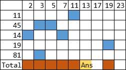
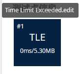

<a class="wp-editor-md-post-content-link" href="https://www.spoj.com/problems/GCDS/">SPOJ 原题传送门</a> <a class="wp-editor-md-post-content-link" href="https://www.luogu.com.cn/problem/SP30919">洛谷RMJ传送门</a>

这是一道数论题。

<h2>思路</h2>

因为要求找到的整数 $x$ 是一个互质于 $a_i$ 的数，所以很显然 $x$ 为质数的时候最优。

根据互质的一些性质，$a_i$ 和 $x$ 没有共同的质因数，所以可以标记所有 $a_i (1\le i\le n)$ 的质因数，然后选取最小的未被标记的质数。

举个例子：
$\rm{a = \tt{[11, 45, 14, 19, 81]}}$
标记如下



故选择13作为 $x$。

<hr />

看到这里，就滚去写代码罢！

<!--more-->

$$ \raisebox{-500px}{} $$

别看了 啥也没有

$$ \raisebox{-500px}{} $$

真的没什么啊

$$ \raisebox{-500px}{} $$

如果你真的按照这篇文章这么做的话，你多半会：



<del>如果没T当我没说</del>

<h2>优化</h2>

暴力的思路是暴力因式分解，但是这样做有十分甚至九分的可能会超时。那怎么优化呢？

可以维护一个数组 $\tt mz$，$\tt mz[\rm{i}\tt]$ 代表 $i$ 的最小质因数，这样就可以避免每次标记都要遍历半天的问题。

怎么维护呢？

显然当 $i$ 是质数时，$\tt mz[\rm{i}\tt] = \rm i$。当 $i$ 不是质数的时候，那么 $i$ 必然可以拆分成 $p\times j$；根据线性筛的原理，当筛到 $p$ 的时候，$p\times j$ 将会被 $p$ 标记。因此，只需要在线性筛中加入一行：

```
mz[i * pm_list[j]] = pm_list[j];
```

就可以达到相应效果。

总的线性筛代码如下：

```
void make_prime_list(int n)
{
    int i, j;
    is_prime[1] = 0;
    for (i = 2; i <= n; i++) {
        if (is_prime[i] == 0) pm_list[++pm_count] = i, mz[pm_list[pm_count]] = i;
        for (j = 1; j <= pm_count && i * pm_list[j] <= n; j++) {
            is_prime[i * pm_list[j]] = 1;
            mz[i * pm_list[j]] = pm_list[j];
            if (i % pm_list[j] == 0) break;
        }
    }
}
```

主函数核心部分代码：

```
while (a > 1) {
    vs[mz[a]] = 1;
    a /= mz[a];
}
```

行了别看了没有完整代码
