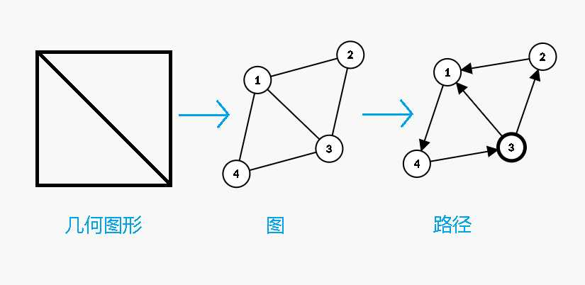
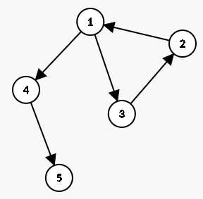
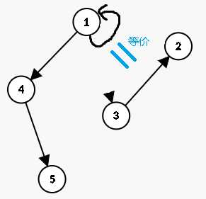

您甭听这个名儿乍一看似乎还蛮高级，但是说出来欧拉（回）路是个啥，用一点点小学奥数知识就可以理解。

都知道“一笔画”问题吧。那么，我告诉你，此“欧拉（回）路”就是“一笔画”的路径。



## 定义/解释

欧拉（回）路/欧拉图的形象解释：

- **欧拉（通）路**：从一个点出发，若有某条路径可以经过这张图所有的边，则这个路径叫做“欧拉（通）路”。
- **欧拉回路**：首尾点是同一个点的欧拉（通）路。

欧拉图：

- **欧拉图**：具有欧拉回路的图
- **半欧拉图**：具有欧拉通路但不具有欧拉回路的图

## 判定
### 无向图
运用小学知识，可以推出：

存在欧拉回路：

1. 是一张连通图
2. 所有顶点的度数都是偶数

存在欧拉路：

1. 是一张连通图
2. 恰有 0 或 2 个奇度顶点

### 有向图
小学不会讲。

存在欧拉回路：

1. 是强连通图
2. 每个顶点的入度和出度相等

存在欧拉路：

1. 是连通图
2. 至多一个顶点的出度减去入度等于 1
3. 至多一个顶点的入度减去出度等于 1
4. 其他顶点的入度和出度相等

## 求欧拉路

### Fleury 算法

OI Wiki（和我）说太复杂太暴力，不推荐，不讲。

### Hierholzer 算法

Hierholzer 算法的大致思想就是把“大的”路径换成短边。

如下图所示。



首先从 $1$ 出发，选择节点 $3$ 作为下一个访问的目标。$3$ 的下一个是 $2$。



然后，发现，缩边等价于直接把访问过后的点给记下。

那么如果 $1$ 一开始走的是 $4$ 呢？

那么就先把 $4$ 和 $5$ 给记下来。

经过多次模拟，发现这些数据刚好可以用一个栈存下来（请自行模拟一下以更好地理解）。

考虑使用 DFS 实现 Hierholzer 算法。

```
void dfs(int curr)
{
	for (int i = 0; i < gr[curr].size(); i++) {
		if (vis[gr[curr][i].second]) continue;
		vis[gr[curr][i].second] = 1;
		dfs(gr[curr][i].first);
	}
	st.push(curr);
}
// 请自行在主函数里判断起点/有无条件。文末放完整代码。
```

兴冲冲的你准备去洛谷上交[模板题](https://www.luogu.com.cn/problem/P7771)。

不出意外的话，你会在 #10 TLE。考虑优化。

## 优化

因为（半）欧拉图的每一条边只会走一次，所以程序有优化空间。

可以对每条边排序，然后标记当前节点所到的边的位置，这样不用特判边是否被访问。

可能嘴上干说有点玄乎，那现在上代码：
```
#include <iostream>
#include <vector>
#include <stack>
#include <algorithm>
#define u first
#define v second
using namespace std;

vector<pair<int, int> > gr[100005];
stack<int> st;

int vis[300005];
int indeg[100005], outdeg[100005];
int pos[300005];
int entry = 0, cnt = 0;
int inner {0}, outer {0};

int idx = 0;
int n, m;
int x, y;

inline void addedge(int a, int b)
{
	gr[a].push_back({b, ++idx});
}

void dfs(int curr)
{
	for (int i = pos[curr]; i < gr[curr].size(); i = pos[curr]) {
		pos[curr]++;
		dfs(gr[curr][i].first);
	}
	st.push(curr);
}

int main()
{
	scanf("%d%d", &n, &m);
	for (int i = 1; i <= m; i++) {
		scanf("%d%d", &x, &y);
		addedge(x, y);
		outdeg[x]++;
		indeg[y]++;
	}
	for (int i = 1; i <= n; i++) {
		sort(gr[i].begin(), gr[i].end());
	}
	for (int i = 1; i <= n; i++) {
		if (outdeg[i] - indeg[i] == 1) {
			entry = i;
			inner++;
		} else if (outdeg[i] - indeg[i] == -1) {
			outer++;
		} else if (outdeg[i] != indeg[i]) {
			cnt = 1;
		}
	}
	if (cnt && !(outer == inner && outer == 1)) {
		printf("No\n");
	} else {
		if (entry == 0) entry = 1;
		dfs(entry);
	}
	while (!st.empty()) {
		printf("%d ", st.top());
		st.pop();
	}
}
```

仔细阅读的话，会好理解得多。

## 例题
- [P7771 【模板】欧拉路径](https://www.luogu.com.cn/problem/P7771)
- [P1341 无序字母对](https://www.luogu.com.cn/problem/P1341)
- [P1127 词链](https://www.luogu.com.cn/problem/P1127)

注意 P1127 词链 的数据很水。我在 Hydro 上构建了一版数据，欢迎来测试。[link](https://hydro.ac/d/Imken_domain/p/L1127)

## 版权信息 Copyrights
头图：Pixiv PID 84715806 使用未经授权 侵权联系我删除

Header image of this article: Pixiv PID 84715806 Unauthorized use, infringement contact me to delete

