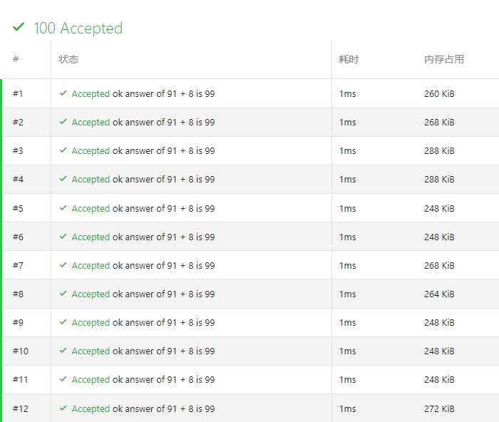
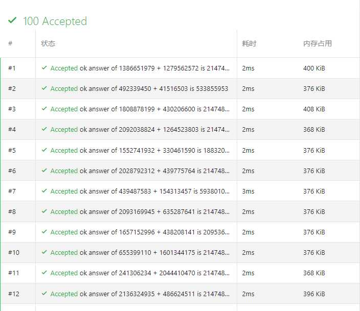

某位同学设计了一个 A + B 的交互题，为了搞随机数据。

但是因为时间函数 `time(0)` 总是返回秒数，就会导致随机数一致的情况：



直到今天，这个搁置了很久的问题我打算去解决一下。

因为之前闲着没事 `cat /dev/random`，自然想到使用 `/dev/random` 解决。但是据说 `/dev/random` 越调用越慢，所以换用更好用的 `/dev/urandom`。

我们需要设法读取 `/dev/urandom`。但是 `freopen/fopen` 会出问题（读不出什么东西，容易挂），所以需要更加手动的方式打开文件。

```
int fd = open("/dev/urandom", O_RDONLY);
```

翻译过来就是说，打开文件 `/dev/urandom`，并以只读模式加载，存在文件标识符 `fd` 里。

~~为什么只读不用说吧~~

（需要头文件 `unistd.h`）

```
read(fd, &seed, sizeof seed);
```

这行的意思是，从文件标识符 `fd` 里（即从 `/dev/urandom` 里）读取一段字节（`buffer`），写入 `seed` 中。

接下来，就是随机数生成了：

```
mt19937 mt_rand(seed);
long long a = mt_rand() % 2147483648;
long long b = mt_rand() % 2147483648;
```

这样生成的随机数，随机又美观。



关于 `read/open`，我觉得[这篇文章](https://www.cnblogs.com/52php/p/5801275.html)讲得很好，可以一看。

